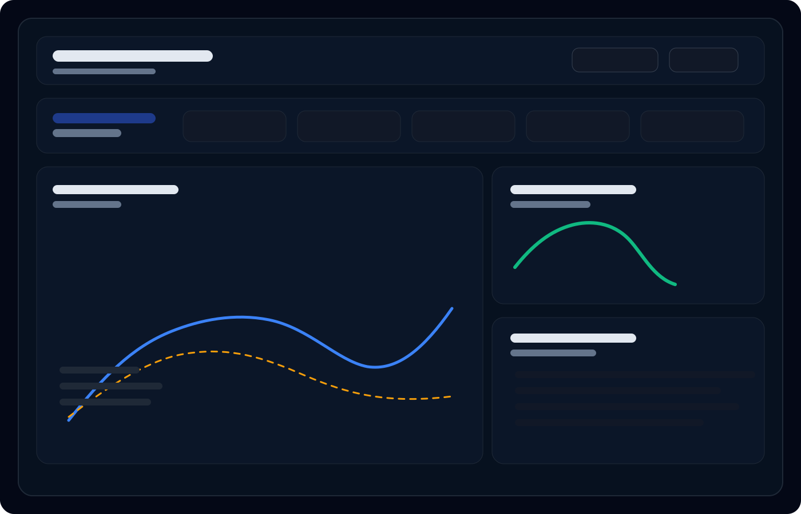

# Enterprise Reinforcement Learning Trading System (QTS)

An institutional-style research platform for building, testing, and monitoring reinforcement learning trading strategies in a controlled simulation environment. The project is designed to reflect how a quantitative research team might approach modeling, execution, risk, and observability rather than simply training an RL agent in isolation.

## What this project is

This repository focuses on three core ideas:

- Research discipline: separating market simulation, portfolio accounting, risk controls, and model logic into distinct components.
- Reproducible experimentation: making strategy behavior inspectable and testable rather than opaque.
- Production-minded engineering: using structured code, automated quality checks, and an interactive dashboard to support iteration.

## Architecture overview

The system is intentionally modular to reduce common research pitfalls such as train/serve skew, hidden leakage, and overly coupled environment code.

- qts_core/: the pip-installable core package containing the trading environment, portfolio ledger, risk framework, and training scaffolding.
- alpha/: abstractions for standardized feature generation and research-oriented signal design.
- envs/: Gymnasium-compatible wrappers that orchestrate agent actions and market interaction.
- portfolio/: mathematical accounting for PnL, cash flow, fees, and position state.
- risk/: hard risk limits and circuit-breaker logic that sit between the policy and the ledger.
- models/: RL training logic and model configuration scaffolding.
- data_platform/: data connectors and a feature-store-oriented registry.
- mlops/: experiment tracking and hyperparameter tuning integration via MLflow.
- dashboard/: FastAPI backend and React/Vite frontend for live telemetry and strategy review.
- research/: a sandbox for alpha discovery and exploratory work.

## Why this project is relevant

This work is intended to demonstrate a research-first approach to applied ML in finance:

- building systems that can be reasoned about and extended,
- evaluating decisions under realistic constraints,
- and connecting quantitative experimentation to operational visibility.

That is the mindset typically expected in roles spanning ML quant research, research engineering, and applied scientific trading.

## Dashboard preview

A realistic view of the research dashboard experience looks like this:



## Quick start

### Recommended environment

This repository is designed to work well in GitHub Codespaces or VS Code Dev Containers, but it can also be run locally with the same dependency stack.

### Install dependencies

```bash
make install
```

### Start the backend

```bash
make api
```

### Start the frontend

In a second terminal:

```bash
make dashboard
```

The dashboard will be available at http://localhost:3000.

## Development workflow

Use the provided Make targets to keep the workflow consistent:

```bash
make format
make lint
make test
make train
```

## Quality controls

This repository includes several engineering safeguards to make it more credible as a research and development platform:

- automated unit and integration testing,
- linting and static type checks with Ruff and MyPy,
- a structured development workflow via Make,
- and a deterministic regression gate for backtest parity.

## CI/CD and governance

The repository includes workflows intended to enforce discipline and prevent silent regressions:

- python-app.yml: runs linting and unit/integration tests on push.
- backtest-parity.yml: blocks changes that materially alter historical backtest results without clear justification.

That combination is important for making the project feel robust rather than merely illustrative.